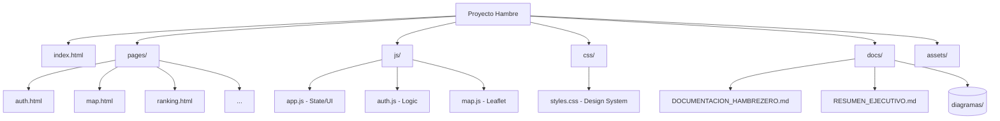
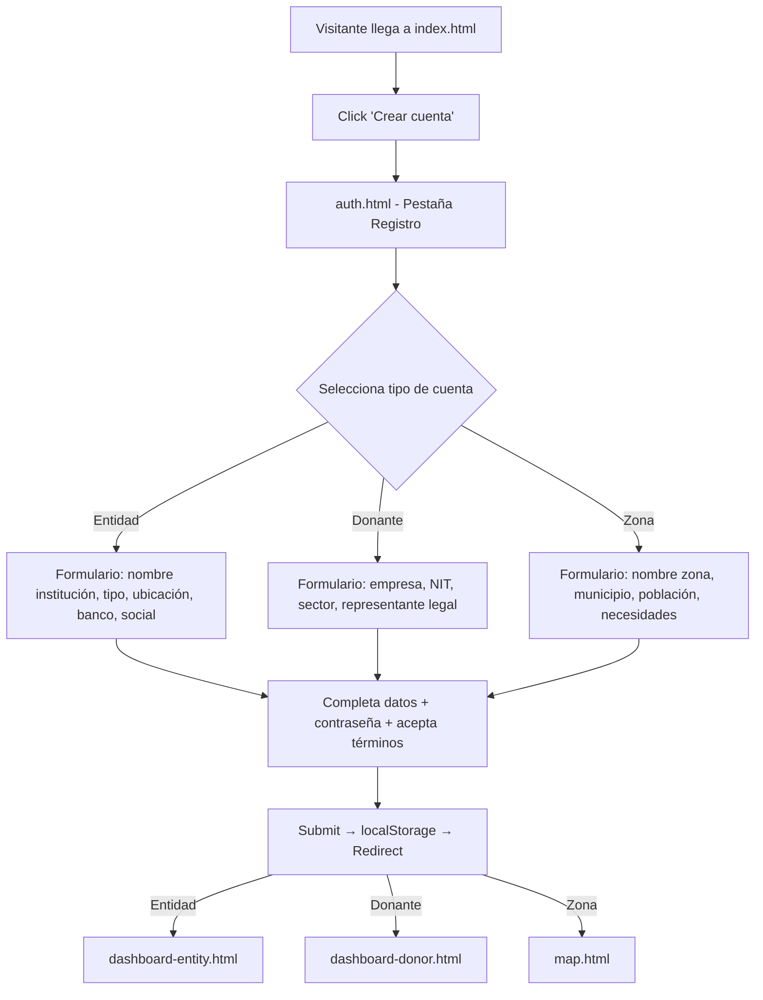
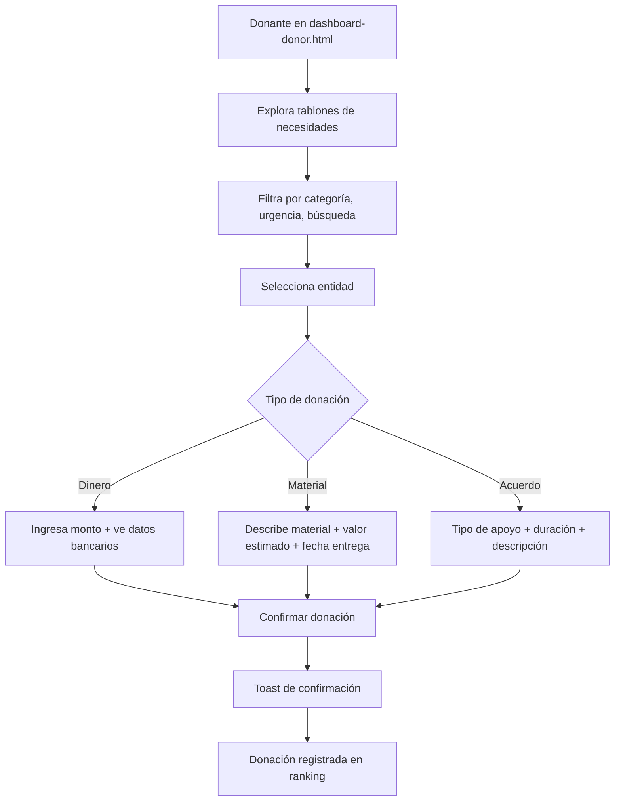
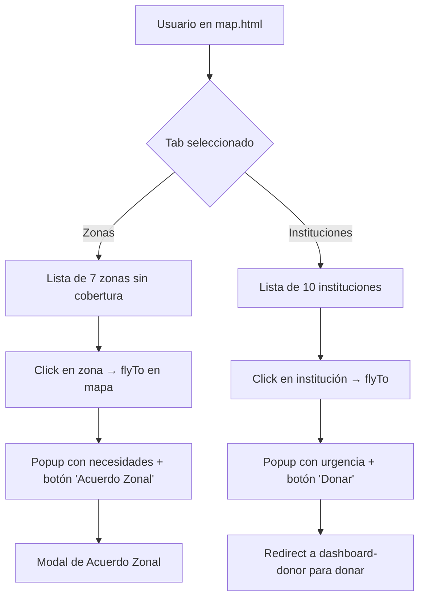

# 📗 Documentación Completa — HambreZero

> **Plataforma colombiana de impacto social que conecta empresas donantes con entidades necesitadas y zonas rurales sin cobertura institucional.**

---

## 📋 Tabla de Contenidos

0. [Resumen Ejecutivo](#0-resumen-ejecutivo)
1. [Descripción General](#1-descripción-general)
2. [Arquitectura del Sistema (SAD)](#2-arquitectura-del-sistema-sad)
3. [Estructura del Proyecto](#3-estructura-del-proyecto)
4. [Stack Tecnológico](#4-stack-tecnológico)
5. [Módulos y Páginas](#5-módulos-y-páginas)
6. [Modelo de Datos](#6-modelo-de-datos)
7. [Diagramas C4](#7-diagramas-c4)
8. [Diagramas UML](#8-diagramas-uml)
9. [Flujos de Usuario](#9-flujos-de-usuario)
10. [Sistema de Diseño (Design System)](#10-sistema-de-diseño)
11. [Historias de Usuario y Sprints](#11-historias-de-usuario-y-sprints)
12. [Privacidad y Accesibilidad](#12-privacidad-y-accesibilidad)
13. [Plan de Validación y Pilotaje](#13-plan-de-validación-y-pilotaje)
14. [API Endpoints (Planificados)](#14-api-endpoints-planificados)
15. [Guía de Despliegue](#15-guía-de-despliegue)
16. [Glosario](#16-glosario)

---

## 0. Resumen Ejecutivo

HambreZero surge como respuesta a la crítica desconexión entre el sector empresarial con excedentes de recursos y las entidades sociales en zonas vulnerables de Colombia. El problema central radica en la falta de transparencia y trazabilidad que genera desconfianza en los procesos de donación. Nuestra población objetivo abarca empresas donantes, instituciones sociales (comedores, escuelas, hospitales) y comunidades rurales o periurbanas sin cobertura institucional formal.

La solución consiste en una plataforma digital integral que centraliza la ayuda social mediante georreferenciación avanzada para mapear necesidades críticas en tiempo real, un sistema de tablones directos para la gestión de recursos y un motor de gamificación corporativa que incentiva la donación mediante rankings públicos y beneficios fiscales auditables. El impacto esperado es la democratización del acceso a los recursos, garantizando una trazabilidad del 100% y fortaleciendo la seguridad alimentaria nacional mediante el uso de tecnología escalable y accesible.

---

## 1. Descripción General

### 1.1 ¿Qué es HambreZero?

**HambreZero** es una plataforma web colombiana fundada con la convicción de que la generosidad empresarial, bien dirigida, puede transformar realidades en los rincones más vulnerables del país. La plataforma conecta tres tipos de actores:

| Actor | Descripción | Funcionalidad Principal |
|-------|-------------|------------------------|
| 🏛️ **Entidad Necesitada** | Colegios, hospitales, comedores comunitarios, hogares de ancianos, etc. | Publica necesidades en tablones públicos, recibe donaciones |
| 🏢 **Empresa Donante** | Empresas con capacidad de donación en dinero o materiales | Dona sin límite, crea acuerdos, aparece en ranking |
| 🗺️ **Zona Geográfica** | Veredas, corregimientos e inspecciones rurales sin instituciones | Se registra en el mapa, recibe visibilidad |

### 1.2 Misión

Facilitar la conexión directa, transparente y verificada entre empresas con capacidad de donar y entidades sociales con necesidades reales — eliminando barreras burocráticas y garantizando que cada peso llegue al lugar donde más se necesita.

### 1.3 Visión

Para 2030, ser la plataforma de impacto social más grande de Latinoamérica: 5 millones de beneficiados, 10 países, $1B COP donados.

### 1.4 Valores

- 🤝 **Transparencia** — Todo es verificable y auditable
- ⚡ **Efectividad** — Conexión directa sin intermediarios
- 🌿 **Inclusión** — Desde ciudades hasta veredas rurales
- 🔒 **Confianza** — Entidades verificadas
- 💪 **Dignidad** — Las necesidades se publican con respeto
- 🚀 **Innovación** — Tecnología al servicio social

### 1.5 Estadísticas (Datos simulados del proyecto)

| Métrica | Valor |
|---------|-------|
| Pesos donados | $4,200,000,000 COP |
| Entidades registradas | 1,248 |
| Empresas donantes | 342 |
| Zonas sin cobertura | 97 |
| Departamentos cubiertos | 22 |
| Personas beneficiadas | 280,000 |

---

## 2. Arquitectura del Sistema (SAD)

### 2.1 Estilo Arquitectónico
HambreZero adopta un estilo de **Arquitectura basada en Componentes** dentro de una **Single Page Application (SPA)** de frontend puro. La organización sigue el principio de separación de preocupaciones (*Separation of Concerns*), segregando la estructura (HTML), la presentación (CSS/Design System) y el comportamiento/estado (JS Modules).

- **Frontend-Heavy**: La mayoría de la lógica de negocio y renderizado se ejecuta en el cliente.
- **Micro-kernel de Estado**: El objeto `AppState` actúa como núcleo centralizado de datos al que los componentes se suscriben.

### 2.2 Atributos de Calidad
Para garantizar la viabilidad técnica exigida por el reto, se han priorizado los siguientes atributos:

| Atributo | Estrategia de Implementación | Escenario de Éxito |
| :--- | :--- | :--- |
| **Usabilidad** | Diseño *Mobile-First*, carga progresiva y sistema de Toasts de bajo latencia. | Un usuario rural con baja alfabetización digital puede registrar una necesidad en <30 seg. |
| **Rendimiento** | Uso de Vanilla JS sin dependencias pesadas, Lazy Loading de activos y caching de Tiles del mapa. | La landing page carga en menos de 1.5s en conexiones 3G. |
| **Escalabilidad** | Modularización estricta por archivos y uso de CSS Custom Properties para el branding. | Añadir una nueva categoría de entidad requiere modificar un solo archivo JSON (`AppState`). |
| **Disponibilidad** | Despliegue como activos estáticos de alta disponibilidad; resiliencia ante caídas de backend mediante Mock Data. | El sistema es plenamente funcional como catálogo visual incluso sin conexión a base de datos externa. |
| **Modificabilidad** | Bajo acoplamiento mediante Event Delegation y uso de constantes centralizadas. | Cambiar la paleta de colores de toda la plataforma se logra editando una sola línea en `:root` de CSS. |

### 2.3 Diagrama de Paquetes
La organización física del código refleja la estructura lógica de la arquitectura:



### 2.4 Visión General de Arquitectura (Contenedores)
El sistema funciona enteramente en el lado del cliente (client-side), con persistencia local.

```
┌─────────────────────────────────────────────────────────────┐
│                     USUARIO (Navegador)                     │
├─────────────────────────────────────────────────────────────┤
│                                                             │
│  ┌──────────────┐  ┌──────────────┐  ┌──────────────────┐  │
│  │  index.html   │  │  auth.html   │  │ dashboard-*.html │  │
│  │  (Landing)    │  │  (Login/Reg) │  │ (Panel Donante/  │  │
│  │              │  │              │  │  Entidad)        │  │
│  └──────┬───────┘  └──────┬───────┘  └────────┬─────────┘  │
│         │                 │                    │            │
│  ┌──────┴─────────────────┴────────────────────┴─────────┐  │
│  │              css/styles.css (Design System)            │  │
│  │              36 KB — Custom Properties & Components    │  │
│  └───────────────────────────────────────────────────────┘  │
│                                                             │
│  ┌───────────┐  ┌───────────┐  ┌───────────┐               │
│  │  app.js   │  │  auth.js  │  │  map.js   │               │
│  │  (Core)   │  │  (Auth)   │  │ (Leaflet) │               │
│  │  27 KB    │  │  13 KB    │  │  19 KB    │               │
│  └─────┬─────┘  └─────┬─────┘  └─────┬─────┘               │
│        │              │              │                      │
│  ┌─────┴──────────────┴──────────────┴─────────────────┐    │
│  │                  localStorage                        │    │
│  │                  (hz_user session)                    │    │
│  └─────────────────────────────────────────────────────┘    │
│                                                             │
├─────────────────────────────────────────────────────────────┤
│                    SERVICIOS EXTERNOS                        │
│  ┌────────────┐  ┌──────────────┐  ┌─────────────────────┐  │
│  │ Leaflet.js │  │ Font Awesome │  │ CARTO Tiles (Mapas) │  │
│  │ v1.9.4     │  │ v6.5.0       │  │ OpenStreetMap       │  │
│  └────────────┘  └──────────────┘  └─────────────────────┘  │
└─────────────────────────────────────────────────────────────┘
```

### 2.5 Arquitectura Futura (Planificada)
Escalabilidad hacia un entorno multinivel distribuido.

```
┌──────────────┐      ┌──────────────┐      ┌─────────────┐
│   SPA Web    │◄────►│  API REST    │◄────►│ PostgreSQL  │
│  (Frontend)  │ JSON │ Node/Express │ SQL  │   (BD)      │
└──────────────┘      └──────┬───────┘      └─────────────┘
                             │
                      ┌──────┴───────┐
                      │    Redis     │
                      │  (Cache)     │
                      └──────────────┘
```

---

## 3. Estructura del Proyecto

```
📦 Proyecto Hambre/
│
├── 📄 index.html                    # Landing Page (punto de entrada)
├── 📄 README.md                     # README del proyecto
│
├── 📁 pages/                        # Páginas de la aplicación
│   ├── auth.html                    # Login / Registro (389 líneas)
│   ├── dashboard-donor.html         # Panel del Donante (456 líneas)
│   ├── dashboard-entity.html        # Panel de la Entidad (462 líneas)
│   ├── map.html                     # Mapa interactivo Leaflet (524 líneas)
│   ├── ranking.html                 # Ranking de donantes (611 líneas)
│   ├── about.html                   # Sobre Nosotros (667 líneas)
│   ├── mobile-preview.html          # Vista previa móvil
│   └── presentacion.html            # Presentación del proyecto
│
├── 📁 css/                          # Estilos
│   └── styles.css                   # Design System completo (36 KB)
│
├── 📁 js/                           # Lógica JavaScript
│   ├── app.js                       # Core: estado, toast, modal, datos mock (27 KB)
│   ├── auth.js                      # Autenticación mock (13 KB)
│   └── map.js                       # Mapa interactivo Leaflet (19 KB)
│
├── 📁 assets/                       # Recursos multimedia
│   └── img/                         # Imágenes del proyecto
│
└── 📁 docs/                         # Documentación
    ├── DOCUMENTACION_HAMBREZERO.md  # Este documento
    ├── 📁 diagramas/
    │   └── HambreZero_Diagramas_C4_UML.drawio  # Diagramas C4 + UML
    └── 📁 historias/
        └── historias-de-usuario.md  # Historias de usuario Scrum
```

### 3.1 Métricas del Código

| Archivo | Líneas | Tamaño | Función |
|---------|--------|--------|---------|
| `styles.css` | ~900+ | 36 KB | Design System completo |
| `app.js` | 598 | 27 KB | Lógica core, mock data, sistemas |
| `auth.js` | 272 | 13 KB | Autenticación mock |
| `map.js` | 329 | 19 KB | Mapa interactivo Leaflet |
| `index.html` | 682 | 30 KB | Landing Page |
| `about.html` | 667 | 34 KB | Página institucional |
| `ranking.html` | 611 | 29 KB | Ranking con podium |
| `map.html` | 524 | 23 KB | Mapa con panel lateral |
| **Total** | **~4,900+** | **~225 KB** | **Full application** |

---

## 4. Stack Tecnológico

### 4.1 Frontend (Implementado)

| Tecnología | Versión | Uso |
|-----------|---------|-----|
| **HTML5** | — | Estructura semántica de todas las páginas |
| **CSS3** | — | Design system con CSS Custom Properties |
| **JavaScript ES6+** | — | Lógica de aplicación, estado, interactividad |
| **Leaflet.js** | 1.9.4 | Mapa interactivo geolocalizado |
| **Font Awesome** | 6.5.0 | Iconografía vectorial |
| **CARTO Tiles** | — | Capa de mapa base (OpenStreetMap) |

### 4.2 Backend (Planificado)

| Tecnología | Uso planificado |
|-----------|-----------------|
| **Node.js + Express** | API REST |
| **PostgreSQL** | Base de datos relacional |
| **Redis** | Cache para ranking en tiempo real |
| **JWT** | Tokens de autenticación |

### 4.3 CDNs Externos

| Recurso | URL |
|---------|-----|
| Font Awesome | `https://cdnjs.cloudflare.com/ajax/libs/font-awesome/6.5.0/css/all.min.css` |
| Leaflet CSS | `https://unpkg.com/leaflet@1.9.4/dist/leaflet.css` |
| Leaflet JS | `https://unpkg.com/leaflet@1.9.4/dist/leaflet.js` |
| CARTO Tiles | `https://{s}.basemaps.cartocdn.com/light_all/{z}/{x}/{y}{r}.png` |

---

## 5. Módulos y Páginas

### 5.1 Landing Page (`index.html`)

La página de inicio es el punto de entrada principal. Contiene:

| Sección | Descripción |
|---------|-------------|
| **Hero** | Animación de partículas, estadísticas flotantes con glassmorphism, CTAs principales |
| **Stats Bar** | Contadores animados con `IntersectionObserver` ($4.2B, 1,248 entidades, 342 empresas, 97 zonas) |
| **Tipos de Cuenta** | Grid de 3 cards interactivos: Entidad, Donante, Zona |
| **Cómo Funciona** | 4 pasos: Registro → Publicación → Conexión → Impacto |
| **Tipos de Entidades** | Grid de 12 categorías (colegios, hospitales, bomberos, etc.) |
| **Ranking Preview** | Top 5 donantes del mes con niveles (Bronce/Plata/Oro/Platino) |
| **CTA Final** | Call-to-action para registro |
| **Footer** | Links, redes sociales, copyright |

### 5.2 Autenticación (`auth.html` + `auth.js`)

Sistema de autenticación con dos paneles:

**Panel izquierdo:** Branding, estadísticas, testimonial.

**Panel derecho:** Formularios dinámicos:

- **Login:** Email + Contraseña + "Recordarme" + Social Auth (Google/Microsoft placeholder)
- **Registro:** Formulario adaptativo según tipo de cuenta:
  - **Entidad:** Nombre institución, tipo, ubicación, teléfono, cuenta bancaria, red social
  - **Donante:** Nombre empresa, NIT, sector, teléfono, representante legal
  - **Zona:** Nombre zona, municipio, población, representante, necesidades

**Autenticación Mock:** Almacena sesión en `localStorage` como `hz_user` con tipo de cuenta, redirige al dashboard correspondiente.

### 5.3 Panel Donante (`dashboard-donor.html`)

Dashboard completo para empresas donantes:

| Componente | Descripción |
|-----------|-------------|
| **Header** | Breadcrumb, título, stats (total donado, donaciones, posición ranking, acuerdos activos) |
| **Level Banner** | Nivel actual (Oro), progreso hacia Platino con barra de progreso |
| **Barra de Filtros** | Búsqueda, chips por categoría (7 filtros), selector de orden |
| **Grid de Tablones** | Cards dinámicos renderizados por `createBulletinCard()` con urgencia, necesidades, botones de acción |
| **Modal Donación** | 3 pestañas: Dinero (montos rápidos), Material (descripción + fecha), Acuerdo (tipo + duración) |
| **Modal Acuerdo** | Formulario de acuerdo continuo de donación |

### 5.4 Panel Entidad (`dashboard-entity.html`)

Dashboard para instituciones registradas:

| Componente | Descripción |
|-----------|-------------|
| **Sidebar (Perfil)** | Avatar, nombre, tipo, verificación, estadísticas (recibido, donaciones, beneficiarios, acuerdos), datos de contacto |
| **Stats Row** | 4 tarjetas: Total recibido, publicaciones activas, acuerdos, beneficiarios |
| **Nueva Publicación** | Formulario con título, descripción, tags de necesidades (sistema de chips con Enter), selector de urgencia (Alta/Media/Baja) |
| **Mis Publicaciones** | Lista de publicaciones activas con acciones (editar, eliminar, vistas) |
| **Historial de Donaciones** | Timeline de donaciones recibidas con donante, fecha, monto, estado |
| **Modal Editar Perfil** | Formulario para actualizar datos de la institución |

### 5.5 Mapa Interactivo (`map.html` + `map.js`)

Mapa geolocalizado de Colombia centrado en el departamento del Huila:

| Componente | Descripción |
|-----------|-------------|
| **Panel Izquierdo** | Header, búsqueda, tabs (Zonas / Instituciones), lista scrollable, leyenda de colores |
| **Mapa (Leaflet)** | Tiles CARTO, marcadores institucionales (cuadrados con emojis), marcadores de zonas (círculos pulsantes) |
| **Controles** | Toggles para capas (instituciones/zonas), filtros por urgencia |
| **Panel Lateral** | Slide-in panel con detalle de zona/institución seleccionada |
| **Stats Overlay** | Pills flotantes con conteo de zonas, instituciones y habitantes |

**Datos del mapa:**
- **7 zonas sin cobertura** en Huila (Charguayaco, San Marcos, Río Frío, El Hobo, La Jagua, Tres Esquinas, El Paraíso)
- **10 instituciones** geolocalizadas (colegios, hospitales, banco de alimentos, etc.)

### 5.6 Ranking de Donantes (`ranking.html`)

Sistema de gamificación con ranking público:

| Componente | Descripción |
|-----------|-------------|
| **Hero** | Título, selector de período (Semana/Mes/Año/Histórico) |
| **Podium** | Top 3 visual con bloques de altura, coronas y avatares (2°, 1°, 3°) |
| **Stats Globales** | Donado este mes, empresas activas, donaciones realizadas |
| **Ranking Completo** | Lista de 8 empresas con posición, nivel, beneficio fiscal por puesto |
| **Sidebar** | Mi posición (#4), certificado RSE, niveles y beneficios, countdown fin de período |
| **Modal Certificado** | Certificado digital con sello oficial, código DIAN, reducción fiscal |

**Sistema de niveles:**

| Nivel | Rango | Beneficio |
|-------|-------|-----------|
| 🥉 Bronce | < $5M COP | Mención en plataforma |
| 🥈 Plata | $5M – $20M | Certificado digital RSE |
| 🥇 Oro | $20M – $100M | Certificado + 2% reducción fiscal |
| 💎 Platino | > $100M | Certificado + 5% fiscal + distinción gubernamental |
| ⭐ Top 5 | Cualquier monto | Reducción especial + distinción pública |

### 5.7 Sobre Nosotros (`about.html`)

Página institucional completa:

| Sección | Contenido |
|---------|-----------|
| **Hero** | Historia y propósito con shapes flotantes animadas |
| **Misión y Visión** | Cards con chips de valores y metas 2030 |
| **Valores** | Grid de 6 valores fundamentales |
| **Historia** | Timeline (2023-2026), estadísticas animadas |
| **Equipo** | 4 miembros: CEO, CTO, Dir. Jurídica, Dir. Diseño |
| **Aliados** | Min. Hacienda, ICETEX, Cruz Roja, Prosperidad Social, Confecámaras, Uniandes |
| **Contacto** | Info de contacto + formulario con select de motivo + redes sociales |

---

## 6. Modelo de Datos

### 6.1 Entidades del Sistema

#### User (Abstracta)
```
User {
  id: UUID (PK)
  email: String (unique)
  passwordHash: String
  firstName: String
  lastName: String
  phone: String
  accountType: Enum('entity', 'donor', 'zone')
  createdAt: DateTime
  isVerified: Boolean
}
```

#### DonorCompany (Extiende User)
```
DonorCompany {
  companyName: String
  nit: String (unique)
  sector: String
  legalRepresentative: String
  totalDonated: Decimal
  rankPoints: Integer
  level: Enum('bronze', 'silver', 'gold', 'platinum')
  rankPosition: Integer
}
```

#### NeedyEntity (Extiende User)
```
NeedyEntity {
  entityName: String
  documentId: String
  entityType: Enum('school','hospital','food','elderly','nursery','fire','farm','library','shelter','health','community','childcare')
  location: String
  latitude: Float
  longitude: Float
  bankAccount: String
  socialMedia: String
  beneficiaryCount: Integer
  totalReceived: Decimal
}
```

#### ZoneRepresentative (Extiende User)
```
ZoneRepresentative {
  zoneName: String
  municipality: String
  department: String
  population: Integer
  representativeName: String
  mainNeeds: List<String>
}
```

#### Bulletin (Tablón de Necesidades)
```
Bulletin {
  bulletinId: UUID (PK)
  entityId: UUID (FK → NeedyEntity)
  title: String
  description: String
  needs: List<String>
  urgency: Enum('high', 'medium', 'low')
  urgencyScore: Integer (0-100)
  targetGoalCOP: Decimal
  raisedCOP: Decimal
  postedAt: DateTime
  isFulfilled: Boolean
}
```

#### DonationTransaction
```
DonationTransaction {
  transactionId: UUID (PK)
  donorId: UUID (FK → DonorCompany)
  entityId: UUID (FK → NeedyEntity)
  amountCOP: Decimal
  donationType: Enum('money', 'material', 'agreement')
  paymentStatus: Enum('pending', 'completed', 'failed')
  message: String
  date: DateTime
}
```

#### GeoZone
```
GeoZone {
  zoneId: String (PK)
  zoneName: String
  department: String
  population: Integer
  latitude: Float
  longitude: Float
  needLevel: Enum('critical', 'high', 'medium', 'low')
  needs: List<String>
  hasInstitutions: Boolean
}
```

#### Agreement (Acuerdo de Donación)
```
Agreement {
  agreementId: UUID (PK)
  donorId: UUID (FK → DonorCompany)
  entityId: UUID (FK → NeedyEntity)
  type: Enum('monetary', 'material', 'technical', 'logistics')
  value: Decimal
  duration: String
  startDate: Date
  status: Enum('active', 'completed', 'cancelled')
}
```

#### FiscalCertificate
```
FiscalCertificate {
  certId: String (PK)
  donorId: UUID (FK → DonorCompany)
  period: String
  totalDonated: Decimal
  level: LevelEnum
  taxReduction: Float (porcentaje)
  issuedAt: DateTime
}
```

### 6.2 Diagrama Entidad-Relación (Textual)

```
User ←──── DonorCompany (herencia)
User ←──── NeedyEntity  (herencia)
User ←──── ZoneRepresentative (herencia)

DonorCompany ──1:N──► DonationTransaction
DonorCompany ──1:N──► Agreement
DonorCompany ──1:N──► FiscalCertificate

NeedyEntity  ──1:N──► Bulletin
NeedyEntity  ──N:1──► GeoZone (ubicación)

DonationTransaction ──N:1──► Bulletin (financia)
Agreement ──N:1──► NeedyEntity
```

---

## 7. Diagramas C4

> **Archivo:** `docs/diagramas/HambreZero_Diagramas_C4_UML.drawio`
> Abrir con [diagrams.net](https://app.diagrams.net/) o la extensión Draw.io de VS Code.

### 7.1 C4 Nivel 1 — Contexto (Pestaña 1)

Muestra el sistema HambreZero en relación con sus actores y sistemas externos:

```
                    ┌───────────────────┐
                    │ Zona Geográfica   │
                    │ (Representante)   │
                    └────────┬──────────┘
                             │ Registra zona/necesidades
                             ▼
┌──────────────┐   ┌──────────────────────┐   ┌──────────────────┐
│   Empresa    │──►│                      │◄──│    Entidad       │
│   Donante    │   │    HAMBREZERO        │   │    Necesitada    │
│              │   │    [Software System] │   │                  │
└──────────────┘   └───────┬──────┬───────┘   └──────────────────┘
  Dona, ranking            │      │             Publica tablones
                           │      │
              ┌────────────┘      └────────────┐
              ▼                                ▼
    ┌──────────────────┐             ┌──────────────────┐
    │ Pasarela de Pagos│             │ DIAN/MinHacienda │
    │ [Externo]        │             │ [Externo]        │
    └──────────────────┘             └──────────────────┘
```

### 7.2 C4 Nivel 2 — Contenedores (Pestaña 2)

Descompone el sistema en sus contenedores técnicos:

| Contenedor | Tecnología | Función |
|-----------|------------|---------|
| **Web Application (SPA)** | HTML/CSS/JS | Interfaz de usuario completa |
| **Design System** | CSS Custom Properties | Tokens, componentes reutilizables |
| **app.js (Core)** | JavaScript | Estado global, Toast, Modal, rendering |
| **auth.js** | JavaScript | Autenticación mock con localStorage |
| **map.js + Leaflet** | JavaScript | Mapa interactivo geolocalizado |
| **localStorage** | Browser API | Persistencia de sesión |
| **API Backend** | *(Planificado)* Node.js/Express | REST API |
| **PostgreSQL** | *(Planificado)* | Base de datos relacional |
| **Redis** | *(Planificado)* | Cache de ranking |

### 7.3 C4 Nivel 3 — Componentes (Pestaña 3)

Descompone el SPA en componentes internos:

**Componentes Core (app.js):**
- `Toast System` — Notificaciones push
- `Modal System` — Diálogos modales
- `AppState` — Estado centralizado
- `fmt Utilities` — Formateo de moneda, fechas, niveles
- `Counter Animation` — Contadores animados
- `Scroll Reveal` — Animaciones al hacer scroll

**Componentes de Negocio:**
- `Bulletin Render` — Generador dinámico de cards de tablón
- `Donation Flow` — Modal de donación (dinero/material/acuerdo)
- `Ranking Engine` — Podium + lista con beneficios
- `Certificate Generator` — Certificado fiscal modal
- `Leaflet Map` — Mapa con marcadores y paneles
- `Auth Module` — Login/Registro con formularios dinámicos

---

## 8. Diagramas UML

### 8.1 Diagrama de Clases y Paquetes (Pestañas 4 y 7)

El diagrama completo de clases incluye:

- **User** (Abstracta) → DonorCompany, NeedyEntity, ZoneRepresentative (herencia)
- **DonationTransaction** ← composición de DonorCompany
- **Bulletin** ← composición de NeedyEntity
- **Agreement** → asociación entre DonorCompany y NeedyEntity
- **FiscalCertificate** → generado por DonorCompany
- **GeoZone** → ubicación de NeedyEntity

Adicionalmente, el **Diagrama de Paquetes UML** (Pestaña 7) ilustra cómo el código base y### 15.3 Despliegue en Producción (Frontend), Componentes Centrales, Utilidades) organizan la estructura descrita en el apartado de Arquitectura (SAD).

### 8.2 Diagrama de Casos de Uso (Pestaña 5)

4 actores y 16 casos de uso:

**Empresa Donante:**
- Registrar cuenta
- Iniciar sesión
- Ver tablones de necesidades
- Realizar donación (dinero/material)
- Crear acuerdo de donación
- Crear acuerdo zonal
- Descargar certificado fiscal
- Ver posición en ranking

**Entidad Necesitada:**
- Registrar cuenta
- Publicar necesidad en tablón
- Editar perfil de entidad
- Ver historial de donaciones recibidas

**Representante Zona:**
- Registrar zona geográfica en mapa

**Visitante Público:**
- Ver ranking de donantes
- Explorar mapa interactivo
- Filtrar y buscar entidades
- Enviar formulario de contacto

### 8.3 Diagrama de Secuencia — Flujo de Donación (Pestaña 6)

```
Donante → SPA → app.js → Modal Donación → Toast → Entidad

1.  Donante navega a Tablones
2.  SPA llama renderBulletins()
3.  app.js retorna AppState.entities[]
4.  Donante filtra por categoría/búsqueda
5.  Donante hace click en "Donar" en un bulletin card
6.  SPA llama openDonationModal(entityId)
7.  app.js recupera datos de la entidad
8.  Modal se abre con formulario de donación
9.  Donante selecciona tipo e ingresa monto
10. Donante hace submit del formulario
11. Modal se cierra
12. Toast muestra confirmación
13. Notificación visual al usuario
14. [Futuro] API registra donación en BD
```

---

## 9. Flujos de Usuario

### 9.1 Flujo de Registro



### 9.2 Flujo de Donación



### 9.3 Flujo del Mapa



---

## 10. Sistema de Diseño

### 10.1 Paleta de Colores

| Variable | Hex | Uso |
|----------|-----|-----|
| `--green-900` | `#051f17` | Fondos oscuros principales |
| `--green-700` | `#116644` | Botones primarios, acentos |
| `--green-600` | `#22976e` | Badges verificados, íconos |
| `--green-400` | `#5cd49d` | Hover states, partículas |
| `--gold-500` | `#f0a500` | CTAs de acento, ranking |
| `--gold-300` | `#fbc94a` | Niveles, certificados |
| `--red-500` | `#e53e3e` | Urgencia alta |
| `--gray-900` | `#1a1a2e` | Texto principal |

### 10.2 Tipografía

| Fuente | Uso |
|--------|-----|
| **Outfit** | Títulos, números destacados (`--font-display`) |
| **Inter** | Texto general, UI (`--font-body`) |

### 10.3 Componentes Reutilizables

| Componente | Clase CSS | Variantes |
|-----------|-----------|-----------|
| **Botón** | `.btn` | `.btn-primary`, `.btn-accent`, `.btn-outline`, `.btn-ghost`, `.btn-white` |
| **Tamaños** | `.btn-sm`, `.btn-lg`, `.btn-xl`, `.btn-block` | — |
| **Badge** | `.badge` | `.badge-green`, `.badge-red`, `.badge-gold` |
| **Chip** | `.chip` | `.chip.active` |
| **Card** | `.stat-card`, `.bulletin-card` | `.urgency-high`, `.urgency-medium`, `.urgency-low` |
| **Modal** | `.modal-overlay`, `.modal` | `.modal-header`, `.modal-body` |
| **Toast** | `.toast` | `.success`, `.warning`, `.error`, `.info` |
| **Progress** | `.progress` | `.progress-bar` (width dinámico) |
| **Level Badge** | `.level-badge` | `.level-platinum`, `.level-gold`, `.level-silver`, `.level-bronze` |
| **Form** | `.form-group`, `.form-control`, `.form-select` | `.input-group`, `.input-icon` |
| **Navbar** | `.navbar`, `.navbar-menu`, `.navbar-brand` | `.scrolled` (on scroll) |
| **Alert** | `.alert` | `.alert-success`, `.alert-info` |
| **Search Bar** | `.search-bar` | Con ícono de búsqueda |
| **Tags** | `.tag`, `.tag-primary` | — |

### 10.4 Animaciones

| Animación | Efecto |
|-----------|--------|
| `float` | Efecto de flotación suave (hero stats) |
| `float-particle` | Partículas ascendentes (hero) |
| `pulse` | Pulsación en marcadores del mapa |
| `spin` | Spinner de carga (loader) |
| `animate-fade-up` | Fade in + slide up (scroll reveal) |
| `counter animation` | Contadores numéricos incrementales |
| `transition-spring` | Transición con efecto spring para hover |

### 10.5 Responsive Breakpoints

| Breakpoint | Cambios |
|-----------|---------|
| `≤ 1024px` | Grid a 1-2 columnas, hero visual hidden, footer 2 cols |
| `≤ 900px` | Auth panel izquierdo hidden, entity layout 1 col, map stack vertical |
| `≤ 768px` | Bulletins grid 1 col |
| `≤ 600px` | Stats 1-2 cols, how-steps 1 col |

---

## 11. Historias de Usuario y Sprints

### Sprint 1: Autenticación, Frontend Base y Arquitectura

| ID | Historia | Persona | Criterio de Aceptación |
|----|----------|---------|------------------------|
| HU-001 | Landing Page atractiva | Frontend UI | Hero animado, contadores, responsividad |
| HU-002 | Vista Login/Registro | Frontend UI | Formularios dinámicos por tipo de cuenta |
| HU-003 | Mapa interactivo base | Frontend Logic | Leaflet.js con mapa centrado en Colombia |
| HU-004 | Esquema BD + Auth endpoints | Backend | ERD, `/api/auth/register`, `/api/auth/login`, JWT |
| HU-005 | Backlog + testing base | PM/QA | Tickets en Jira/Trello, testing manual |

### Sprint 2: Tablones, Paneles y Mapa Avanzado

| ID | Historia | Persona | Criterio de Aceptación |
|----|----------|---------|------------------------|
| HU-006 | Dashboard Entidad | Frontend UI | Sidebar, cards de donación |
| HU-007 | Tablón de necesidades | Frontend UI | Grid CSS, etiquetas de urgencia |
| HU-008 | Mapa con zonas e instituciones | Frontend Logic | Pines, tabs, flyTo interactivo |
| HU-009 | API de tablones | Backend | Endpoints `/api/bulletins` GET/POST |
| HU-010 | Testing de filtros | PM/QA | Pruebas UAT en staging |

### Sprint 3: Donación, Ranking y Beneficios

| ID | Historia | Persona | Criterio de Aceptación |
|----|----------|---------|------------------------|
| HU-011 | Ranking visual | Frontend UI | Podium Top 3, listado Top 5 con coronas |
| HU-012 | Modal de donación | Frontend UI | Selectores de monto, tipos de pago |
| HU-013 | Flujo de donación | Frontend Logic | Formulario, contadores incrementales |
| HU-014 | Certificado virtual | Frontend Logic | Modal DOM dinámico con datos del usuario |
| HU-015 | Backend donaciones + ranking | Backend | `/api/donations/process`, `/api/ranking` |
| HU-016 | Testing final | PM/QA | Concurrencia, entrega, demo |

### Distribución del Equipo

| Rol | Persona | Especialidad |
|-----|---------|-------------|
| 👩‍💻 P1 | Frontend Developer | UI/UX & Componentes |
| 🧑‍💻 P2 | Frontend Developer | Lógica JS, API, Leaflet |
| 👨‍💻 P3 | Backend Engineer | Database, APIs REST |
| 👩‍💼 P4 | PM / Scrum Master | Gestión ágil, QA |

---

## 12. Privacidad y Accesibilidad

Para dar cumplimiento a los requerimientos éticos y legales (Ley 1581 de 2012 en Colombia sobre Protección de Datos Personales), HambreZero incorpora los siguientes criterios desde el diseño:

### 12.1 Protección de Datos
- **Manejo de Información Sensible:** Los datos exactos de ubicación y contacto de ciertas entidades (ej. refugios de víctimas) se anonimizan públicamente y solo se liberan a empresas donantes una vez que se firma un *Acuerdo de Confidencialidad (NDA)* interno en la plataforma.
- **Transparencia Financiera:** Los datos de transacciones no exponen la salud financiera detallada de las empresas, centrándose exclusivamente en montos destinados a RSE.
- **Consentimiento:** El registro requiere la aceptación explícita de políticas de privacidad claras, separando el consentimiento de marketing del consentimiento operativo.

### 12.2 Accesibilidad y No Estigmatización
- **Lenguaje Inclusivo y Respetuoso:** En los *tablones*, se prohíbe el uso de lenguaje victimizante. Se fomenta un tono de "empoderamiento y colaboración" en lugar de "asistencialismo".
- **Accesibilidad Web (a11y):** La interfaz utiliza alto contraste (paleta verde/oro sobre oscuros o claros legibles), soporta navegación por teclado y está preparada para lectores de pantalla.
- **Bajo Ancho de Banda:** Las vistas están optimizadas para conexiones precarias, cargando el mapa de Leaflet solo a petición y utilizando una UI que minimiza peticiones a la red.

---

## 13. Plan de Validación y Pilotaje

Para asegurar que la Propuesta de Valor se ajusta a las necesidades reales (Product-Market Fit social), se propone la siguiente fase de validación técnica y comercial:

### 13.1 Piloto Controlado: "Neiva Zero"
- **Entorno de Prueba:** Selección de 10 entidades sociales en la ciudad de Neiva (ej. comedores comunitarios en comunas vulnerables, escuelas periurbanas) y 3 empresas locales de la Cámara de Comercio del Huila.
- **Duración:** 4 Semanas.
- **Variables a Medir (KPIs):**
  - *Tiempo de adopción:* Cuánto tarda una entidad en registrar correctamente 3 necesidades.
  - *Tasa de Match:* Porcentaje de necesidades publicadas que son cubiertas por las 3 empresas.
  - *Fricción Transaccional:* Encuestas cualitativas sobre la facilidad de uso del "Acuerdo de Donación" versus los procesos en papel habituales.

### 13.2 Iteración del Prototipo
Al finalizar el piloto, la arquitectura permite escalar los servicios (pasando del Mock actual a los servicios REST planificados) y refinar la interfaz móvil antes de un lanzamiento departamental y, posteriormente, nacional.

---

## 14. API Endpoints (Planificados)

### 14.1 Autenticación

| Método | Endpoint | Body | Respuesta |
|--------|----------|------|-----------|
| `POST` | `/api/auth/register` | `{ email, password, type, ...fields }` | `{ user, token }` |
| `POST` | `/api/auth/login` | `{ email, password }` | `{ user, token }` |
| `POST` | `/api/auth/logout` | — | `{ success }` |
| `GET` | `/api/auth/me` | — | `{ user }` |

### 14.2 Tablones (Bulletins)

| Método | Endpoint | Descripción |
|--------|----------|-------------|
| `GET` | `/api/bulletins` | Lista todos los tablones (filtros: type, urgency, search) |
| `GET` | `/api/bulletins/:id` | Detalle de un tablón |
| `POST` | `/api/bulletins` | Crear nuevo tablón (auth: entity) |
| `PUT` | `/api/bulletins/:id` | Actualizar tablón |
| `DELETE` | `/api/bulletins/:id` | Eliminar tablón |

### 14.3 Donaciones

| Método | Endpoint | Descripción |
|--------|----------|-------------|
| `POST` | `/api/donations/process` | Registrar nueva donación |
| `GET` | `/api/donations/history/:userId` | Historial de donaciones |
| `GET` | `/api/donations/received/:entityId` | Donaciones recibidas por entidad |

### 14.4 Ranking

| Método | Endpoint | Descripción |
|--------|----------|-------------|
| `GET` | `/api/ranking` | Ranking completo (filtros: period) |
| `GET` | `/api/ranking/position/:donorId` | Mi posición actual |
| `GET` | `/api/ranking/certificate/:donorId` | Generar certificado fiscal |

### 14.5 Zonas y Entidades

| Método | Endpoint | Descripción |
|--------|----------|-------------|
| `GET` | `/api/zones` | Lista todas las zonas geográficas |
| `GET` | `/api/entities` | Lista entidades registradas |
| `GET` | `/api/entities/:id` | Perfil de entidad |
| `PUT` | `/api/entities/:id` | Actualizar perfil |

### 14.6 Acuerdos

| Método | Endpoint | Descripción |
|--------|----------|-------------|
| `POST` | `/api/agreements` | Crear nuevo acuerdo |
| `GET` | `/api/agreements/:donorId` | Acuerdos del donante |
| `PUT` | `/api/agreements/:id/status` | Cambiar estado del acuerdo |

---

## 15. Guía de Despliegue

### 15.1 Requisitos

- Servidor web estático (Nginx, Apache, Netlify, Vercel, GitHub Pages)
- No requiere backend (actualmente datos mock)
- Conexión a internet para CDNs (Font Awesome, Leaflet, CARTO tiles)

### 15.2 Instalación Local

```bash
# Clonar repositorio
git clone <repo-url>
cd "Proyecto Hambre"

# Opción 1: Abrir directamente
open index.html

# Opción 2: Servidor local (recomendado para CORS)
npx serve .
# o
python3 -m http.server 8080
```

### 13.3 Estructura de Despliegue

```
/
├── index.html          ← Punto de entrada
├── auth.html
├── dashboard-donor.html
├── dashboard-entity.html
├── map.html
├── ranking.html
├── about.html
├── mobile-preview.html
├── presentacion.html
├── css/styles.css
├── js/app.js
├── js/auth.js
└── js/map.js
```

### 15.4 Variables de Entorno (Futuro)

```env
DATABASE_URL=postgresql://...
REDIS_URL=redis://...
JWT_SECRET=...
PAYMENT_GATEWAY_KEY=...
DIAN_API_KEY=...
```

---

## 16. Glosario

| Término | Definición |
|---------|------------|
| **Tablón** | Publicación de necesidades de una entidad visible para donantes |
| **Entidad** | Institución social registrada que necesita apoyo (colegio, hospital, etc.) |
| **Donante** | Empresa que aporta dinero, materiales o acuerdos de donación |
| **Zona geográfica** | Área rural sin instituciones formales registrada en el mapa |
| **Acuerdo** | Compromiso continuo de donación entre empresa y entidad |
| **Certificado fiscal** | Documento oficial que acredita la donación ante la DIAN |
| **Ranking** | Clasificación pública de empresas por monto donado |
| **Nivel** | Categoría del donante según monto acumulado (Bronce/Plata/Oro/Platino) |
| **Top 5** | Los 5 donantes con mayor aporte en un período, reciben beneficios tributarios |
| **Urgencia** | Nivel de prioridad de una necesidad (Alta 🔴, Media 🟡, Baja 🟢) |
| **flyTo** | Función de Leaflet.js que anima el mapa hacia coordenadas específicas |
| **AppState** | Objeto JavaScript centralizado que contiene el estado global de la aplicación |
| **Mock Data** | Datos simulados (MOCK_ENTITIES, MOCK_DONORS, MOCK_ZONES) que reemplazan una API real |
| **RSE** | Responsabilidad Social Empresarial |
| **DIAN** | Dirección de Impuestos y Aduanas Nacionales de Colombia |
| **NIT** | Número de Identificación Tributaria |
| **COP** | Peso Colombiano (moneda) |

---

## 📎 Archivos de Referencia

| Archivo | Ubicación |
|---------|-----------|
| Resumen Ejecutivo (Hackathon) | `docs/RESUMEN_EJECUTIVO.md` |
| Diagramas C4 + UML (draw.io) | `docs/diagramas/HambreZero_Diagramas_C4_UML.drawio` |
| Historias de usuario | `docs/historias/historias-de-usuario.md` |
| Esta documentación | `docs/DOCUMENTACION_HAMBREZERO.md` |

---

> **HambreZero** © 2026 — Hecho con 💚 para Colombia
> 
> *Documentación generada el 15 de abril de 2026*
